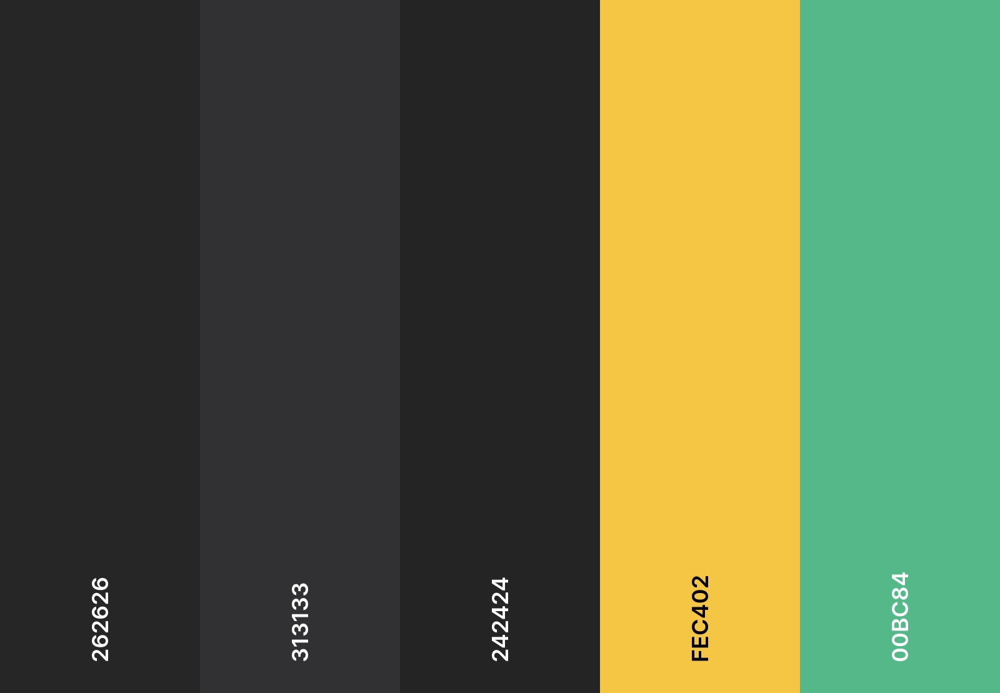

# **Punters Quiz**

The Punters quiz is a basic quiz than covers popular pub quiz trivia. This site will cover twenty questions on random topics and give the user a score at the end of the quiz. Keepping the quiz breif but enjoyable this quiz can be for any user who wants to challenge their knowledge either as an individual or in a team. 

View the live website here [Punters Quiz](https://bruce0c.github.io/Punters-Quiz-/index.html).


## User Experience

### Initial Discussion
Pub quizes have always been a good reaon for people to come together, get to know new friends and meet old ones. All the while showing off being either an expert on random trivia or clueless amazed that anyone would have answer these questions. Quizes are also a good way to spend a casual evening with friends and have friendly competition.  

### External User's Goal:

* To be able to visit the website and play the game.
* To have fun while engaging ones brain.
* To be able to play the game on different devices.


### Site Owner's Goal:

* Make a quiz that responds to varying device sizes. 
* Idicates wether or not a question is correct or incorrect.
* Records the final score at the end of the quiz. 

### Possible Future Plans:

* To add more than 100 or more questions that are randomly generated thereby ensuring the users wont have the same questions asked when playing again.
* To include a feature where users can save their progress form a previouse game and see if they can beat thier high score. 
* To include a feature that can accept multiple teams on the same game and record all team scores in the same game. 
* To add a timer that disables all buttons after one minute, if the user has not answered a question they would get no points. 

* [Resources, References and Credit](#resources-references-and-credit)
    
## Features
 The website has two pages.
 * Landing page - this is where the quiz is introduced and explained.
 * Quiz page- this is where the quiz is staged.

### Landing Page

* The page has a simple design.
* Quiz exmplanation and rules
* "Start Quiz" button for easy access to the quiz
* The website is fully responsive on all screen sizes.
* Short and to the point this pub quiz aims to get the user quickly from the landing page to the quiz. 
* All these features aim to help to immediately show and entice the user what the website is about and how much fun they will have should they decide to proceed and play the game.


### Quiz  page
 * The quiz page comsists of:
    * A header that will send the user back to the home page when clicked. 
    * A progress bar that will fill from left to right.
    * A question and answer area
    * Numbered questions to keep track of the users progress.
    * A "Next" button that appears after a question had been answered. 


* When hovered over the button will change color to highlight potential choice.


* When an answer is selected the button will change colour to either green or red. 
* Green highlighting correct answers and red highlighting incorrect answers.


* When an aswer is selected the next button then appears to move on to the next question.


* As the user moves through the questions, a progress bar fill relative to the amount of questions they answer.


### Existing Features

* Responsive to device size.
* Buttons will change colour to yellow when hovered over. 
* Buttons will change colour when selected to indicate the correct/incorect answer.
* Next button appears when a question is answered.
* "Punters Quiz" header will take user back to the home page if clicked, reseting the quiz.
* Final score is shown at the end of the quiz.

### Color Scheme

The colour scheme for this was kept dark to reflect the envirnoment the user might be in. Since pub quizes are hosted at night, it is best to have dark backgrounds and bight content so the user an easily identify the page. This choice also improve the user experience as their eyes wont have to work hard to adjust when interacting with others and looking at the screen. 




### Accessibility

Accesibility is achieved through:

 * High colour contracting throughtout the website
 * Using semantic HTML.
 * Alt attribute is used on the logo image

### 404 Page
 A custom 404 page was made for the site to keep the theme consistent throughout. the ingormation guides users back to the site in the event the use the wrong URL or use broken links.


## Design

### Wireframes
The wireframes used were generated from Balsamiq https://balsamiq.com/wireframes/desktop/
As the design of the site was kept simple, there were no deviations from the initial wireframes. Thre may be slight fieerences in how the wuiz are adjusts to the different device sizes. 
<br><br>
Home page
<br><br>


Quiz page.


Results page


## Technologies

* HTML
    * This was used to structure the website.
* CSS
    * The Website includes custom CSS to style effects and the website.
* JavaScript
    * JavaScript was used for interactivity.
* GitHub
    * Source code is hosted on [GitHub](https://github.com) and delpoyed using.
* Visual studio code
    * [VS Code](https://code.visualstudio.com/) was used to commit and push code to the website.
* Font Awesome
    * Icons for the favicon and the website logo where created using [Fontawsome](https://fontawesome.com)
* Balsamiq
    * Wireframes were created using [Balsamic Wireframes](https://balsamiq.com/) 
* Procreate
    * [Proceate](https://procreate.com/) was used to edite and style the favicon, logo image and 404 image.


## Testing

The website was tested throughout the creation and development process.
The validators used to check for bugs were:
 * [Chrome Developer tools](https://developer.chrome.com/docs/devtools)
 * [HTML checker](https://validator.w3.org/)
 * [CSS validation service](https://jigsaw.w3.org/css-validator/)

See [TESTING.md](TESTING.md) for an overview of website testing and debugging.


# Deployment

## Version Control

The site was created using the Visual Studio code editor and pushed to github to the remote repository ‘Punters Quiz’.

The following git commands were used throughout development to push code to the remote repo:

```git add <file>``` - This command was used to add the file(s) to the staging area before they are committed.

```git commit -m “commit message” ``` - This command was used to commit changes to the local repository queue ready for the final step.

```git push``` - This command was used to push all committed code to the remote repository on github.


## Deployment to Github Pages

This project was created through [GitHub](https://github.com/):

1. Locating repository, clicking on the "New" button.
2. Selecting the relevant template: "Code-Institute-Org/gitpod-full-template"
3. Adding the repository name "Punters Quiz".
4. Clicking the button "Create repository".

This project was developed using [Visual Studio Code](https://code.visualstudio.com/) and committed and pushed to GitHub using the VS-Code source control feature. Following "git commands" were used:

1. **Commit** - This command for multiple files to the staging area before pushing the code to Github.
2. **git commit -m "Message explaining update"** - Typically the message would inlcude "docs:, style: and fix:" before the message explaining the update to clarify the nature of the commit.
3. **Push** - After commiting the changes, select the dropdown menu on the commit button and select "Push". This action sent all changes to the Github repository. 

This project was deployed from its Github repository to Github Pages:

1. Log in to Github account
2. From the projects repository selecting "Settings" tab.
3. Click on "Pages" from the left-hand menu
4. The "Source" box must state "Deplay from branch"
5. Under "Branch", click the dropdown named "None" and select "main".
6. Click save.
7. After a few seconds, refresh the page and retrieve the link.


### Clone the Repository Code Locally

Navigate to the GitHub Repository you want to clone to use locally:

- Click on the code drop down button
- Click on HTTPS
- Copy the repository link to the clipboard
- Open your IDE of choice (git must be installed for the next steps)
- Type git clone copied-git-url into the IDE terminal

- The project will now have been cloned on your local machine for use.


## Resources, References and Credit

### Media and Fonts

- Fontawesome : Logo
- Procreate : Editing
 
### Code credits
- W3schools.com:[Arrays](https://www.w3schools.com/js/js_arrays.asp), [Variables](https://www.w3schools.com/js/js_variables.asp)and [Functions](https://www.w3schools.com/js/js_functions.asp)
- Treehouse "Beginner JavaScript Project: Build a Quiz App" : Used tp gain and understanding of concept and layout.
- James Q Quick "Build a Quiz App(6)" : Used to create loading bar.
- Fontawesome: Used to create a Favicon
- Great Stack "How To Make Quiz App Using JavaScript | Build Quiz App With HTML CSS & JavaScript" : used to prpertly structure javascript.
- Bootstrap, [flex](https://getbootstrap.com/docs/5.3/utilities/flex/#enable-flex-behaviors) and [buttons](https://getbootstrap.com/docs/5.3/components/buttons/#base-class): used to style buttons and make the website more responsive.

### Content

All questions provided were taken from [Paul Cooper.uk](https://paulcooper.uk/2021/01/01/100-pub-quiz-trivia-questions-part-1/) "100 free pub quiz trivia questions.