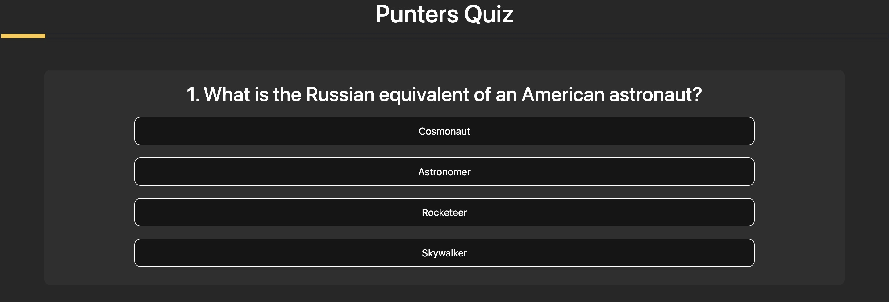

# **Punters Quiz**

The Punters quiz is a basic quiz than covers popular pub quiz trivia. This site will cover ten questions on random topics and give the user a score at the end of the quiz. The quiz is breif but enjoyable and is for any user who wants to challenge their knowledge either as an individual or in a team. 

View the live website here [Punters Quiz](https://bruce0c.github.io/Punters-Quiz-/index.html).


## User Experience

### Initial Discussion
Pub quizes have always been a good reaon for people to come together, get to know new friends and meet old ones. All the while showing off being either an expert on random trivia or clueless amazed that anyone would have answer these questions. Quizes are also a good way to spend a casual evening with friends and have friendly competition.  

### External User's Goal:

* Play a Quiz Game: Users should be able to start and play a quiz game with a set number of questions (up to 10 or the total number of available questions).
* Answer Questions: Users should be able to select answers for each question and receive immediate feedback on whether their answer is correct or incorrect (via color changes on the buttons).
* Track Progress: Users should see their progress through the quiz via a progress bar that updates as they answer questions.
* View Final Score: At the end of the quiz, users should be able to see their final score out of the total number of questions.
* Replay the Quiz: Users should have the option to restart the quiz and play again after completing it.
* Engage with Randomized Content: Users should experience a randomized order of questions and answers each time they play, ensuring a fresh experience.
* Time-Efficient Gameplay: The quiz is designed to be concise, with a maximum of 10 questions, making it suitable for quick play sessions.


### Site Owner's Goal:

* Responsive and Interactive Design: Ensure the quiz is interactive, with buttons that respond to user input and disable after being clicked to prevent multiple selections.
* Provide a Functional Quiz: Ensure the quiz works seamlessly, allowing users to start, progress through questions, and complete the quiz.
* Randomized Content: Implement randomization of both questions and answers to provide a fresh experience every time the quiz is played.
* Answer Feedback: Provide immediate feedback to users by visually indicating whether their selected answer is correct (e.g., turning the button green or red).
* Score Tracking: Keep track of the user's score throughout the quiz and display the final score at the end.
* Progress Tracking: Include a progress bar that updates dynamically as users answer questions, showing how far they are in the quiz.
* Replayability: Allow users to restart the quiz after completing it, ensuring they can play multiple times.

### Possible Future Plans:

* To add more than 100 or more questions that are randomly generated thereby ensuring the users wont have the same questions asked when playing more than two games.
* To include a feature where users can save their progress form a previouse game and see if they can beat thier high score. 
* To include a feature that can accept multiple teams on the same game and record all team scores in the same game. 
* To add a timer that disables all buttons after one minute, resulting in the user not getting points for time wasting. 
    
## Features
 
 1. Quiz Initialization:
* The quiz starts with a shuffled set of questions.
* The quiz is limited to a maximum of 10 questions or the total number of available questions, whichever is smaller.

 2. Randomized Questions and Answers:
* Questions are shuffled at the start of the quiz.
* Answers for each question are also randomized to ensure a fresh experience.

3. Question Display:
* Displays the current question along with its number.
* Dynamically generates answer buttons for each question.

4. Answer Selection:
* Users can select an answer by clicking on a button.
* Immediate feedback is provided by changing the button color to green (correct) or red (incorrect).
* All answer buttons are disabled after a selection to prevent multiple clicks.

5. Score Tracking:
* The user's score is tracked and updated for each correct answer.

6. Progress Bar:
* A progress bar dynamically updates to show the user's progress through the quiz.

7. Next Question Navigation:
* A "Next" button allows users to proceed to the next question.
* The button text changes to "Finish" on the last question.

8. Final Score Display:
* At the end of the quiz, the user's final score is displayed.

9. Replayability:
* After completing the quiz, users can restart the quiz by clicking the "Play Again" button.

10. Interactive Design:
* Buttons are interactive and visually respond to user input.
* Answer buttons are disabled after being clicked to prevent multiple selections.


### Landing Page

The page has a simple design.
* Quiz exmplanation and rules
* "Start Quiz" button for easy access to the quiz
* The website is fully responsive on all screen sizes.
* Short and to the point this pub quiz aims to get the user quickly from the landing page to the quiz. 


### Quiz  page

The quiz page comsists of:
*  A header that will send the user back to the home page when clicked. 
*  A progress bar that will fill from left to right.
*  A question and answer area.
*  Numbered questions to keep track of the users progress.
*  A "Next" button that appears after a question had been answered. 


* When hovered over the button will change color to highlight potential choice.


* When an answer is selected the button will change colour to either green or red. 
* Green highlighting correct answers and red highlighting incorrect answers.


* When an aswer is selected the next button then appears to move on to the next question.


* As the user moves through the questions, a progress bar fill relative to the amount of questions they answer.


### Existing Features

* Responsive to device size.
* Buttons will change colour to yellow when hovered over. 
* Buttons will change colour when selected to indicate the correct/incorect answer.
* Next button appears when a question is answered.
* "Punters Quiz" header will take user back to the home page if clicked, reseting the quiz.
* Final score is shown at the end of the quiz.

### Color Scheme

The colour scheme for this was kept dark to reflect the envirnoment the user might be in. Since pub quizes are hosted at night, it is best to have dark backgrounds and bight content so the user an easily identify the page. This choice also improve the user experience as their eyes wont have to work hard to adjust when interacting with others and looking at the screen. 


### Accessibility

Accesibility is achieved through:

 * High colour contracting throughtout the website
 * Using semantic HTML.
 * Alt attribute is used on the logo image

### 404 Page
 A custom 404 page was made for the site to keep the theme consistent throughout. the ingormation guides users back to the site in the event the use the wrong URL or use broken links.


## Design

### Wireframes
The wireframes used were generated from Balsamiq https://balsamiq.com/wireframes/desktop/
As the design of the site was kept simple, there were no deviations from the initial wireframes. Thre may be slight fieerences in how the wuiz are adjusts to the different device sizes. 
<br><br>
Home page
<br><br>


Quiz page.


Results page


* 17 out of 20 used as a place holder, the final product only asks 10 questions.


## Technologies

* HTML
    * This was used to structure the website.
* CSS
    * The Website includes custom CSS to style effects and the website.
* JavaScript
    * JavaScript was used for interactivity.
* GitHub
    * Source code is hosted on [GitHub](https://github.com) and delpoyed using.
* Visual studio code
    * [VS Code](https://code.visualstudio.com/) was used to commit and push code to github.
* Font Awesome
    * Icons for the favicon and the website logo where created using [Fontawsome](https://fontawesome.com)
* Balsamiq
    * Wireframes were created using [Balsamic Wireframes](https://balsamiq.com/) 
* Procreate
    * [Proceate](https://procreate.com/) was used to edite and style the favicon, logo image and 404 image.

## Testing

The website was tested throughout the creation and development process.
The validators used to check for bugs were:
 * [Chrome Developer tools](https://developer.chrome.com/docs/devtools)
 * [HTML checker](https://validator.w3.org/)
 * [CSS validation service](https://jigsaw.w3.org/css-validator/)
 * [Jshint](https://jshint.com/)

See [TESTING.md](TESTING.md) for an overview of website testing and debugging.

## Deployment to GitHub

### Creating the Repository on GitHub

1. Log in to your [GitHub account](https://github.com/).
2. Click on the **New** button to create a new repository.
3. Select the relevant template (e.g., "Code-Institute-Org/gitpod-full-template").
4. Enter the repository name (e.g., "Punters Quiz").
5. Click the **Create repository** button.

### Committing and Pushing Code to GitHub

This project was developed using [Visual Studio Code](https://code.visualstudio.com/) and committed and pushed to GitHub using the VS Code source control feature. The following Git commands were used:

1. **Stage Changes**: Add files to the staging area using the command:
   ```bash
   git add .

2. **Commit Changes**: Commit the staged changes with a descriptive message:
   ```bash
   git commit -m "Your commit message here"
* Use prefixes like docs:, style:, or fix: in the commit message to clarify the nature of the update.

3. Push Changes: Push the committed changes to the GitHub repository:
   ```bash
   git push

Alternatively, you can use the VS Code source control feature:

1. Stage changes by clicking the + icon next to the files.
2. Add a commit message in the text box and click the Commit button.
3. Use the dropdown menu on the commit button and select Push to send the changes to the GitHub repository.


### Clone the Repository Code Locally

To clone the GitHub repository to your local machine, follow these steps:

1. Navigate to the GitHub repository you want to clone.
2. Click on the **Code** dropdown button.
3. Select **HTTPS** and copy the repository link to your clipboard.
4. Open your IDE or terminal (ensure Git is installed on your system).
5. In the terminal, type the following command and press Enter:
   ```bash
   git clone <copied-git-url>


## Resources, References and Credit

### Media and Fonts

| Resource                          | Purpose       |
|-----------------------------------|---------------|
| [FontAwesome](https://fontawesome.com/) | Logo          |
| [Procreate](https://procreate.com)      | Editing       |
 
### Code credits

| Resource                                                                                     | Purpose                                                                                     |
|---------------------------------------------------------------------------------------------|---------------------------------------------------------------------------------------------|
| [W3Schools: Arrays](https://www.w3schools.com/js/js_arrays.asp), [Variables](https://www.w3schools.com/js/js_variables.asp), [Functions](https://www.w3schools.com/js/js_functions.asp) | Used to learn about JavaScript arrays, variables, and functions.                            |
| [Treehouse: Beginner JavaScript Project - Build a Quiz App](https://www.youtube.com/watch?v=_FnFPmA87XU) | Used to gain an understanding of concepts and layout.                                       |
| [James Q Quick: Build a Quiz App (6)](https://www.youtube.com/watch?v=4bctmtuZVcM)          | Used to create the loading bar.                                                            |
| [FontAwesome](https://fontawesome.com/)                                                     | Used to create a favicon.                                                                  |
| [Great Stack: How To Make Quiz App Using JavaScript](https://www.youtube.com/watch?v=PBcqGxrr9g8) | Used to properly structure JavaScript.                                                     |
| [Bootstrap: Flex](https://getbootstrap.com/docs/5.3/utilities/flex/#enable-flex-behaviors), [Buttons](https://getbootstrap.com/docs/5.3/components/buttons/#base-class) | Used to style buttons and make the website more responsive.                                |

### Content

All questions provided were taken from [Paul Cooper.uk](https://paulcooper.uk/2021/01/01/100-pub-quiz-trivia-questions-part-1/) "100 free pub quiz trivia questions.

## Acknowledgements

I would like to thank my mentor [Tim Nelson](https://github.com/TravelTimN) for his help on this project.