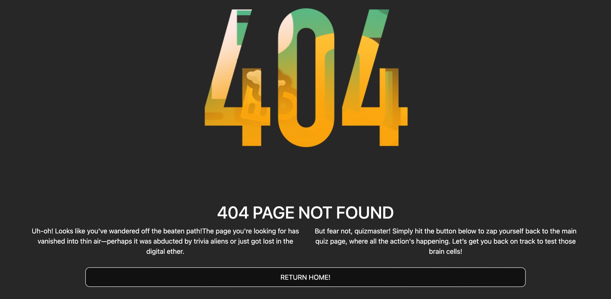

# Testing

## Functional Testing

---

| Page       | Test   | Completed successfully |
| :--------- | :------------------------------------------------------------------------------------- | :--------------------: |
| All        | Navigation links to relevant pages                             |          Yes           |
| All        | Hover effect over buttons                                      |          Yes           |
| Home page  | Images and text flex responsively                              |          Yes           |
| Home page  | "Start Quiz" button takes user to the quiz page when clicked   |          Yes           |
| Quiz       | Question and answer content fits within the screen             |          Yes           |
| Quiz       | Questions and answers load in correct order question           |          Yes           |
| Quiz       | Progress bar fills when user moves through the questions       |          Yes           |
| Quiz       | Green background appears on correct answer                     |          Yes           |
| Quiz       | Red background appears on incorrect answers                    |          Yes           |
| Score      | User can see their results when quiz is complete               |          yes           |

**Navigation Links**

As there are on;y two pages the navigation.

| Navigation Link | Page to Load  | Completed |
|-----------------|---------------|-----------|
| Sart quiz       |  quiz.html    |   Yes     |
| Punters QUIZ    |  index.html   |   Yes     |

## Code Validator Testing

### HTML

I have used the recommended [HTML W3C Validator](https://validator.w3.org) to validate all of my HTML files.

| Directory | File | URL | Screenshot | Notes |
| --- | --- | --- | --- | --- |
|  | [404.html](https://github.com/Bruce0C/Punters-Quiz-/blob/main/404.html) | [HTML Validator](https://validator.w3.org/nu/?doc=https://bruce0c.github.io/Punters-Quiz-/404.html) |  |  No errors returned |
|  | [index.html](https://github.com/Bruce0C/Punters-Quiz-/blob/main/index.html) | [HTML Validator](https://validator.w3.org/nu/?doc=https://bruce0c.github.io/Punters-Quiz-/index.html) |  | No errors returned |
|  | [quiz.html](https://github.com/Bruce0C/Punters-Quiz-/blob/main/quiz.html) | [HTML Validator](https://validator.w3.org/nu/?doc=https://bruce0c.github.io/Punters-Quiz-/quiz.html) |  | No errors returned |

### CSS 

I have used the recommended [CSS Jigsaw Validator](https://jigsaw.w3.org/css-validator) to validate all of my CSS files.

| Directory | File | URL | Screenshot | Notes |
| --- | --- | --- | --- | --- |
| assets | [style.css](https://github.com/Bruce0C/Punters-Quiz-/blob/main/assets/css/style.css) | [CSS Validator](https://jigsaw.w3.org/css-validator/validator?uri=https://bruce0c.github.io/Punters-Quiz-) |  | Test returned no errors |

### JS

I have used the recommended [JShint Validator](https://jshint.com) to validate all of my JS files.

| Directory | File | URL | Screenshot | Notes |
| --- | --- | --- | --- | --- |
| assets | [questions.js](https://github.com/Bruce0C/Punters-Quiz-/blob/main/assets/js/questions.js)| https://bruce0c.github.io/Punters-Quiz-/quiz.html|  | ⚠️ Notes (if applicable) |
| assets | [script.js](https://github.com/Bruce0C/Punters-Quiz-/blob/main/assets/js/script.js) |https://bruce0c.github.io/Punters-Quiz-/quiz.html|  | ⚠️ Notes (if applicable) |

## WAVE

Accessibility standards were checked using [WAVE](https://wave.webaim.org/).

|  Page  | Screenshot |
| --- | --- | 
| Home|  | 
| Quiz|  | 

Testing was focused to ensure the following criteria were met:

- All forms have associated aria-labels so that this is read out on a screen reader to users who tab to form inputs.
- Color contrasts meets acceptable ratio
- Importance of content is relayed correctly through header levels.
- All not textual content had alternative text or titles.
- HTML page lang attribute has been set.
- Aria properties have been implemented correctly.

## LightHouse

Lighthouse was accessed through Developer Tools in Chrome and used to analyse:

- Performance
- Accessibility
- Best practice
- SEO

I've tested my deployed project using the Lighthouse Audit tool to check for any major issues. Some warnings are outside of my control, and mobile results tend to be lower than desktop.

| Page | Mobile | Desktop |
| --- | --- | --- |
| Home |   |  |
| Quiz |  |  |
| 404 |   |  |

## Responsiveness

All pages were tested to ensure responsiveness on screen sizes from 375px and upwards.

Direct testing was done on an iPhone 12, Ipad 12, Macbook and an HP M22f (21.5") screen.

I've tested my deployed project to check for responsiveness issues.

| Page | Mobile | Tablet | Desktop | Notes |
| --- | --- | --- | --- | --- |
| Home |  |  |  | Works as expected |
| Quiz |  |  |  | Works as expected |
| 404 |  |  |  | Works as expected |

## Browser Compatibility

I've tested my deployed project on multiple browsers to check for compatibility issues.

| Page | Chrome | Safari | Notes |
| --- | --- | --- | --- |
| Home |  |   | Works as expected |
| Quiz |  |    | Works as expected |
| 404 |  |   | Works as expected |

## User Story Testing

| Target | Expectation | Outcome | Screenshot |
| --- | --- | --- | --- |
| As a user | I would like to start the quiz by clicking a clearly visible start button | so that I can begin answering the quiz questions |   |
| As a user | I would like to answer a total of 10 questions in the quiz | so that I can fully test my knowledge |  |
| As a user | I would like to see the correct answer highlighted in green after selecting an option | so that I can clearly identify the correct answer |  |
| As a user | I would like to see incorrect answers highlighted in red after making a selection | so that I can understand which answers were wrong | |
| As a user | I would like the application to have high-contrast colors and accessible fonts | so that I can easily read and interact with it. |  |
| As a user | I would like clear labels and instructions | so that I understand how to use the app without confusion. |  |
| As a user |I would like the next button to appear only after I select an answer | so that I can move through the quiz at the correct pace|  |
| As a user |  I would like buttons to change color when I hover over them | so that I can see visual feedback and know the app is responsive  |  |
| As a user | I would like to see a 404 error page if I get lost | so that it's obvious that I've stumbled upon a page that doesn't exist. | |
| As a user | I would like to see my final score displayed at the end of the quiz | so that I can understand how well I performed |   |
| As a user | I would like to be prompted to try the quiz again after finishing | so that I can improve my score by replaying |   |

**QUIZ Testing**

The answer button were tested to ensure the user could, select an anwer, be informed if the they were correct and have the next button appear as a prompt to move through the questions:

_Scenario One - Correct Answer_

Steps to test:

1. Navigate to [Punters Quiz](https://bruce0c.github.io/Punters-Quiz-/index.html) home page.

2. Click 'Start quiz' button:
   
3. Click the correct answer to question 1.

4. The background of the correct answer turns green. 

Expected:

A point is awarded to the user and the next button appears.

Actual:

Website behaved as expected with no errors. 

_Scenario Two - Incorrect answer_

Steps to test:

1. Navigate to [Punters Quiz](https://bruce0c.github.io/Punters-Quiz-/index.html) home page.

2. Click 'Start quiz' button:
   
3. Click the incorrect answer to question 1.
 
4. The background of the incorrect answer turns red.

5. The correct answer should be revealed simultaneously with a green background.

Expected:

No points are awareded to the user and the next button appears.

Actual:

Website behaved as expected. If the user only selects incorrect answers, the final score will show as '0 out of 10'. 

## Resolved issues/bugs

* The initial W3S Mark Up Validation returned some warnings and a single error for the home page. The error was due to an unused variable and all warnings were a result of trailing slashes on void elements. All errors and warnings were resoleved.
* The initial JsHint test results returned with multiple warnings in regards to semicolons being left out. As JS Hint highlights these errors the issue was quickly resolved. 

**Interactivity**:

- Expected: That all JavaScript functions would work as intended for the website's optimum interactivity.
- Actual: Most of of the functions work however disabling the answer button also means being unable to show the correct/ incorrect answers.
- Solution: By using "button.correct:disabled" and "button.incorrect:disabled" in the css file, this ensures the colors for correct and incorrect answers are visible even when the buttons are disabled. Changing the default styling of the disabled buttons to make them visible but non-interactive.

**Score**:

- Expected: One point is awarded for each correct answer, for a total of 10 points. 
- Actual: When clicked more than once, the same correct answer can award multiple points before moving on to the next question.
- Solution: By using "button.disabled = true" in javascript, this prevents users from scoring more than once for each question.