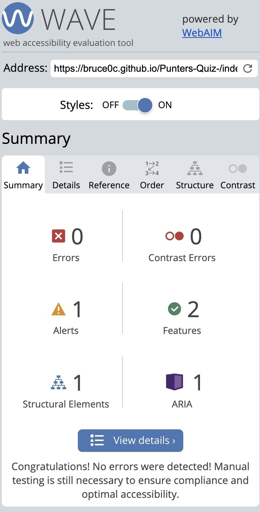
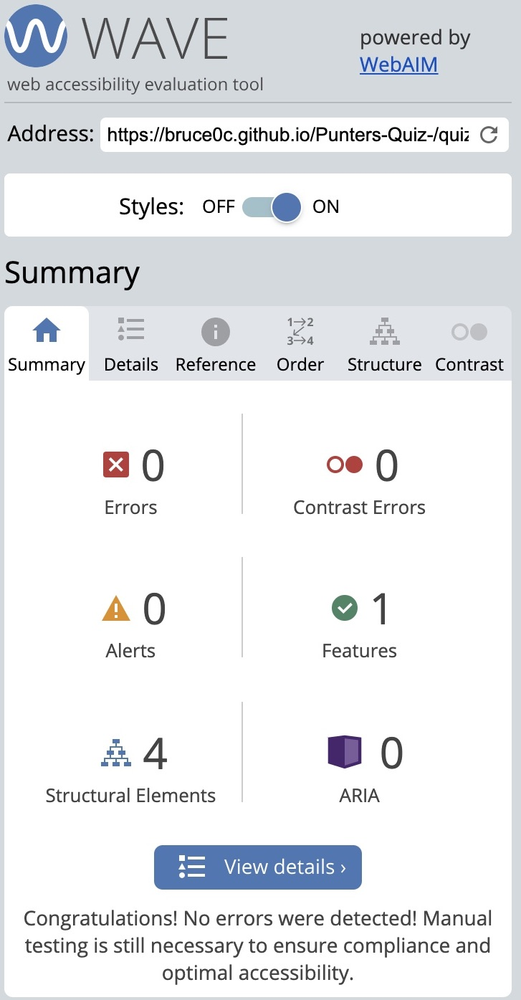
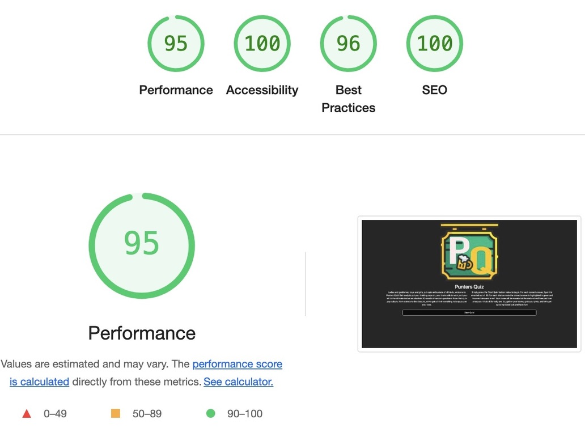

# Testing

## Contents

- [Functional Testing](#functional-testing)
- [Validator Testing](#validator-testing)
  - [HTML](#html)
  - [CSS](#css)
  - [JS](#js)
- [WAVE](#wave)
- [LightHouse](#lighthouse)
- [Browser Compatibility](#browser-compatibility)
- [Responsivity](#responsivity)
- [Issues/ Bugs Found & Resolved](#issues-bugs)
- [Unresolved](#unresolved)

## Functional Testing

---

| Page       | Test                                                                                   | Completed successfully |
| :--------- | :------------------------------------------------------------------------------------- | :--------------------: |
| All        | Navigation links to relevant pages                                                     |          Yes           |
| All        | Hover effect over buttons                                                              |          Yes           |
| Homepage   | Images and text flex responsively                                                      |          Yes           |
| Home page  | "Start Quiz" button takes user to the quiz page when clicked                           |          Yes           |
| Quiz       | Question and answer content fits within the screen                                     |          Yes           |
| Quiz       | Questions and answers load in correct order question                                   |          Yes           |
| Quiz       | Progress bar fills when user moves through the questions                               |          Yes           |
| Quiz       | Green background appears on correct answer                                             |          Yes           |
| Quiz       | Push current question out of question array                                            |          Yes           |
| Quiz       | Reddisplayed                                                                           |          Yes           |
| Score      | user can see their results when quiz is complete                                       |          yes           |

**Navigation Links**

As there are on;y two pages the navigation.

| Navigation Link | Page to Load  | Completed |
|-----------------|---------------|-----------|
| Sart quiz       |  quiz.html    |   Yes     |
| Punters QUIZ    |  index.html   |   Yes     |

## Validator Testing

---

### HTML

[W3C Markup Validator](https://validator.w3.org/)

- No errors were returned when passing through the official W3S validator

Result

Home Page

Quiz Page

### CSS 

[W3C CSS Validator](https://jigsaw.w3.org/css-validator/)

This test returned no errors.
Results for the CSS:

Result

- Home Page

Quiz Page

### JS

[JSHint JS Validator](https://jshint.com/)

All JavaScript files were validated through JSHint.

Result

## WAVE

---

[WAVE](https://wave.webaim.org/)

Accessibility standards were checked using WAVE WebAIM

Result

Testing was focused to ensure the following criteria were met:

- All forms have associated labels or aria-labels so that this is read out on a screen reader to users who tab to form inputs.
- Color contrasts meet a minimum ratio as specified in WCAG 2.1 Contrast Guidelines.
- Heading levels are not missed or skipped to ensure the importance of content is relayed correctly to the end user.
- All content is contained within landmarks to ensure ease of use for assistive technology, allowing the user to navigate by page regions.
- All not textual content had alternative text or titles so descriptions are read out to screen readers
- HTML page lang attribute has been set.
- Aria properties have been implemented correctly.
- WCAG 2.1 Coding best practices being followed.

## LightHouse

---

Lighthouse was accessed through Developer Tools in Chrome and used to analyse:

- Performance
- Accessibility
- Best practice
- SEO

Homepage

Quiz Page

## Browser Compatibility

---

This website was tested on Chrome and Safari for desktop. The website was also tested on Safari for iphones and ipad, macbook 

## Responsivity

---

### Responsiveness

All pages were tested to ensure responsiveness on screen sizes from 375px and upwards.

Responsiveness was tested through Chrome Developer tools. The devices tested include:

- iPhone SE
- iPhone XR
- iPhone 12 Pro
- iPhone 14 Pro Max
- Pixel 7
- Samsung Galaxy S8+
- Samsung Galaxy S20 Ultra
- iPad Mini
- iPad Air
- iPad Pro
- Surface Pro 7
- Surface Duo
- Galaxy Z Fold 5
- Asus Zenbook Fold
- Samsung Galaxy A51/71
- Nest Hub
- Nest Hub Max

I was able to directly test the website on an iPhone 12, Ipad 12 , Macbook and an HP M22f (21.5") screen .

Steps to test:

1. Open browser and navigate to Punters Quiz
2. Open the developer tools (right click and inspect)
3. Set to responsive and decrease width to 375px
4. Set the zoom to 90%
5.  Click and drag the responsive window to maximum width.

Results:

- The website was responsive on all screen sizes.
-  No horizontal scroll was present.
-  No elements overlaped

**QUIZ Testing**

The answer button were tested to ensure the user could, select an anwer, be informed if the they were correct and have the next button appear as a prompt to move through the questions:

_Scenario One - Correct Answer_

Steps to test:

1. Navigate to [Punters Quiz](https://bruce0c.github.io/Punters-Quiz-/index.html) home page.

2. Click 'Start quiz' button:
   
3. Click the correct answer to question 1.
4. When no longer hovering over the question, the background of the button should be green. 

Expected:

A point is awarded to the user and the next button appears.

Actual:

Website behaved as expected with no errors, however when clicked more than once points are continously awarded for each click of the same button. 

_Scenario Two - Incorrect answer_

Steps to test:

1. Navigate to [Punters Quiz](https://bruce0c.github.io/Punters-Quiz-/index.html) home page.

2. Click 'Start quiz' button:
   
3. Click the incorrect answer to question 1.
4. When no longer hovering over the question, the background of the button should be red.
5. The correct answer should be revealed simultaneously with a green background.

Expected:

No points are awareded to the user and the next button appears, allowing them to move through the quiz.

Actual:

Website behaved as expected. If the user only selects incorrect answers, the final score will show as '0 out of 20" 

## Issues/ Bugs Found & Resolved

---

### Validation Issues

The initial W3S Mark Up Validation returned some warning and a single error for the home page. The error was due to an unused variable and allwarning were a result of trailing slashes on void elements. All errors and warnings were resoleved.
The initial JsHint test results returned with multiple warnings in regards to semicolons being left out. as JS Hint highlights these errors the issue was quickly resolved. 

## Unresolved

## Bugs/Unfixed Bugs

There were two main bugs I found when making the website. The first bug was, clicking the same aswer more than ones will keep adding to the score. The second was, disabling the answer buttons after selectiong an answer also removed the pages ability to show the correct/incorrect background colours. 

Interactivity:
- Expected: That all JavaScript functions would work  as intended for the website's optimum interactivity.
- Actual: Most of of the functions work however disabling the answer button also means being unable to show the correct/ incorrect answers.
- Solution: When looking through numerous tutorials and discusing the possible solution to this problem with my mentor, I was able to get the desired result by using "button.disabled = true" in javascript

Score:
- Expected: One point is awarded for each correct answer, for a total of 20 points. 
- Actual: When clicked more than once, the same correct answer can award multiple points before moving on to the next question.
- Solution: When looking through numerous tutorials and discusing the possible solution to this problem with my mentor, I was able to get the desired result.

